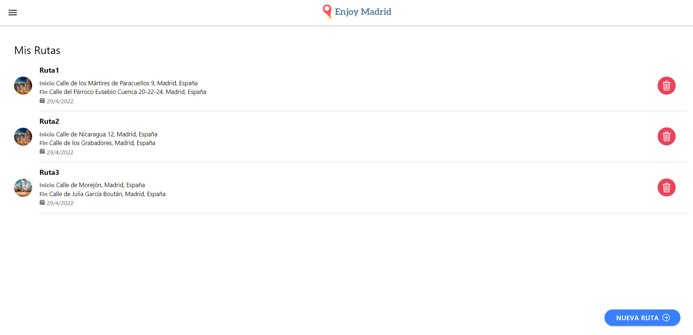

# EnjoyMadrid

<p align="justify">
  Enjoy Madrid is a mobile and desktop application developed in Ionic and Spring Boot. Created to recommend sustainable routes in the city of Madrid, it includes air pollution factors in the creation of routes, in addition to taking into account the tourist preferences of users. Users can also search for different places in Madrid by categories or a search bar (e.g. to search for hamburger joints).
</p>
 
 

<hr>

## List of Contents
1. [Introduction](#introduction)
2. [App Walkthrough](#app-walkthrough)
3. [Setting Up](#setting-up)

<a name="introduction"></a>
## Introduction

- User can create, modify or delete an account.
- When creating a route the user sets the name, the origin and destination, the tourist preferences, the walking distance between transports, and the transports he/she wants to use.
- Routes are associated to the user if he/she is logged in, otherwise routes are stored in local storage or IndexedDB.
- User can explore places in Madrid according to category or by search bar.
- User can choose any place as favourite.

<a name="app-walkthrough"></a>
## App Walkthrough

#### 1. User sign up: 
<p align="center">
  
</p>

#### 2. User sign in: 
<p align="center">
  
</p>

#### 3. User update profile:
<p align="center">
  
</p>

#### 4. User delete account:
<p align="center">
  
</p>

#### 5. Explore places in Madrid:
<p align="center">
  
</p>

#### 6. Find information about the place you want to visit:
<p align="center">
  
</p>

#### 7. Favourite place:
<p align="center">
  
</p>

#### 8. Create route:
<p align="center">
  
</p>

#### 9. View the route itinerary:
<p align="center">
  
</p>

#### 10. Retrieve stored routes:
<p align="center">
  
</p>

#### 11. Delete the route you no longer need:
<p align="center">
  
</p>

<a name="setting-up"></a>
## Setting Up 

### Docker

You can build the docker serve image with the following command:\
`docker build .`\
You can also download the image from Docker Hub:\
`docker pull jos3lu/enjoy-madrid:latest`\
Here is the link to Docker Hub: <https://hub.docker.com/r/jos3lu/enjoy-madrid>\
You can run a docker compose with the image and a mariaDB database, by going to the docker directory inside the enjoymadrid-backend directory and running the following command:\
`docker-compose up`\
The server will run in port 8080.

### JAR File

If you want to run the application standalone, download and run the jar file with the following command (the jar file is located in Releases).\
`java -jar enjoymadrid-backend-0.0.1.jar`\
Where **enjoymadrid-backend-0.0.1.jar** is the path to the jar file on your file system.

Server needs a MariaDB database running (Offical page of MariaDB: <https://mariadb.org/>). When you create the database call it enjoy_madrid.
```
Database access credentials:
	Username: root
	Password: 1234
```

### Web Page

Page can be found here: [https://enjoy-madrid-d18ed.web.app/](https://enjoy-madrid-d18ed.web.app/)
